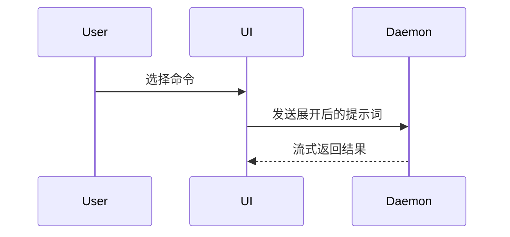

撰写 PR 正文时使用这个模板：

```markdown
## Summary

<图、diff 示意图或目录树>

## Evidence

- **Before:** <截图/输出/失败测试>
  **After:** <截图/输出/通过测试>

## Merge Danger

**Door:** <单向或双向>

<可选：说明>

**Blast Radius:** <一个词描述>

<可选：合并后可能产生的影响>
```

## 章节

跳过开场白，文字保持简短。使用 `GLOSSARY.md` 中的用户领域语言。

### Summary

选择能清楚说明关键点的最小视图。

- 逻辑或算法用伪代码：

```text
on(save)
  if content is unchanged
    return cached result
  write new content
  return fresh result
```

- 运行时控制流用调用树：

```text
submitForm
  createSession
    persistPrompt
    launchAgent
  navigateToSession
```

- UI 结构用组件树，标出重要状态和模块边界：

```text
<SessionPage> (apps/example/src/routes/session.tsx)
  useSessionEvents()
  <SessionToolbar>
    <RunSkillButton> (packages/ui)
```

- 文件职责或大范围重构用浅层文件树：

```text
src/
├── commands/       # 解析用户操作
├── sessions/       # 持有会话状态
└── transport/      # 发送 API 请求
```

- 组件交互、控制流或数据流用 Mermaid：



- 当要说明的是变化、且周围结构已存在时，用 `diff`；让 diff 的形态与主题一致。

组件变化：

```diff
 <SessionPage>
   useSessionEvents()
   <SessionToolbar>
+    <RunSkillButton />
   <SessionTimeline>
+    <SkillResultCard />
```

文件布局变化：

```diff
 src/
 ├── commands/
+│   └── show-me.ts       # 展开斜杠命令
 ├── sessions/
-└── transport.ts
+└── transport/
+    ├── client.ts
+    └── stream.ts
```

调用树或调用栈变化：

```diff
 submitForm
   createSession
     persistPrompt
+    expandSkillMention
     launchAgent
-  navigateToSession
+  navigateToSession
+    subscribeToEvents
```

状态或控制流变化：

```diff
 on(save)
-  write content
+  if content is unchanged
+    return cached result
+  write new content
+  invalidate cache
```

- 当大部分内容都是新增、遗漏上下文会掩盖职责归属或执行顺序，或用户需要可复制的目标形态时，展示整个代码块：

```ts
function expandSkill(command: string): string {
  const skillName = command.slice(1);
  return `use the ${skillName} skill`;
}
```

#### 指引

每个视觉元素都应紧挨着支撑它的简短文字。只保留足以回答用户当前问题或解决当前讨论点的调用、文件、prop、状态和边界。

可以用其中一种，也可以用几种，但几乎不需要全部用上。根据情况判断，不要让用户信息过载。

### Evidence

提供变更有效的具体证据，展示变更前后。

环境支持且变更涉及视觉呈现时，截图是最高等级证据。

执行证据次之，包括测试结果、控制台输出。用伪代码展示过去失败、现在通过的确切测试。

### Merge Danger

说明这是单向门还是双向门。双向门可以回退，单向门不可逆。易于回滚的 PR 风险更低；涉及破坏性操作或难以撤销的决定是单向门。

爆炸半径指 PR 变更的潜在影响或波及范围。考虑所有可能性，例如布局偏移、下游使用者损坏、移动端适配等。
