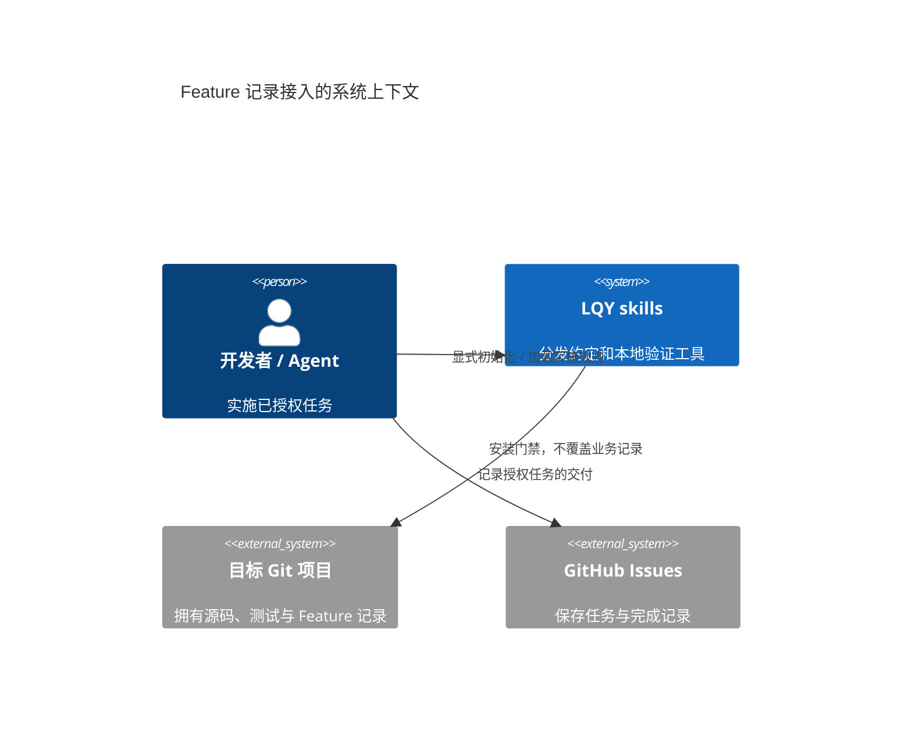
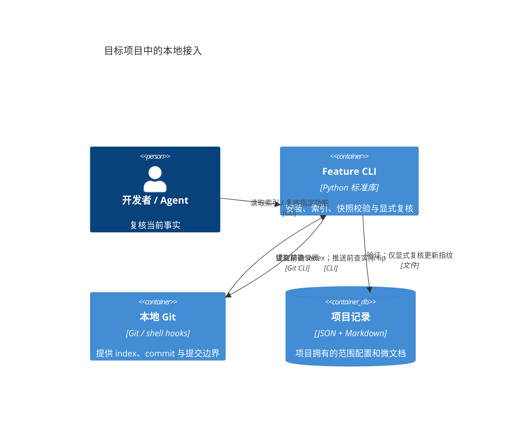

# Feature 微文档接入

## 当前 → 目标

当前：setup 配置 tracker；implement 通过 Git/issue 记录交付；仓库没有统一的 Feature 同步门禁。目标：在这些既有入口接入一个本地 CLI；不新增 skill、调度器、数据库或 CI 服务。

## Module / Contract / Governance

- **Module / Interface**：setup skill 携带唯一实现；公共 CLI 为 `install/list/check/review`，项目统一入口 `.feature-docs/run`。内部隐藏 Git 快照、归属、指纹和安装收据。
- **Adapter / Seam**：Git 是真实 Adapter；以 CLI 退出码和真实 commit/push 为 test surface。工作区、index、commit 是不同的验证输入，不能互借内容。
- **Boundary / Locality**：`.feature-docs/config.json` 记录项目选择的 `managed` 范围与安装资产；`docs/features/` 是项目数据，不放入会被 skills 同步覆盖的安装目录。
- **Governance**：仅显式 setup 安装；既有 hooks、修改过的安装资产或冲突配置则拒绝覆盖。升级保留范围和业务记录；不自动生成能力事实或刷新业务指纹。
- **范围**：仅约束声明的 source globs；未纳管的目录不宣称受保护。本仓库先试用 setup、implement、已安装 skills 同步三个能力，不为每个 skill 复制说明。
- **质量边界**：Git hooks 检查记录结构、引用和版本绑定；业务测试仍由项目已有验证命令执行。不把散文准确性、业务测试通过、issue 关闭或不能绕过 hooks 伪装成 CLI 保证。
- **不变项**：to-spec/to-tickets、Mermaid gate、Ralph 调度与 Git-bound issue 契约不变；根 `./setup` 仍仅复制架构约束。
