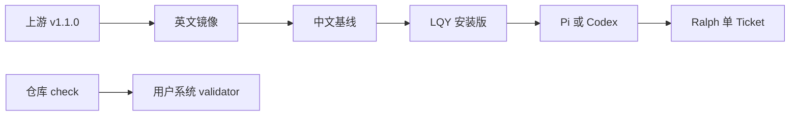
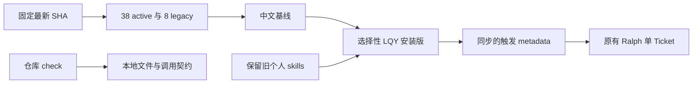
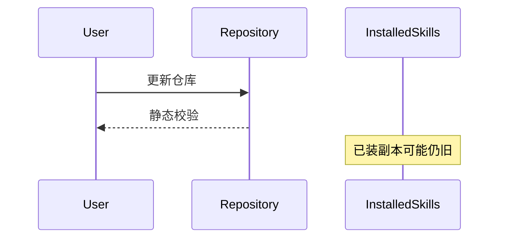
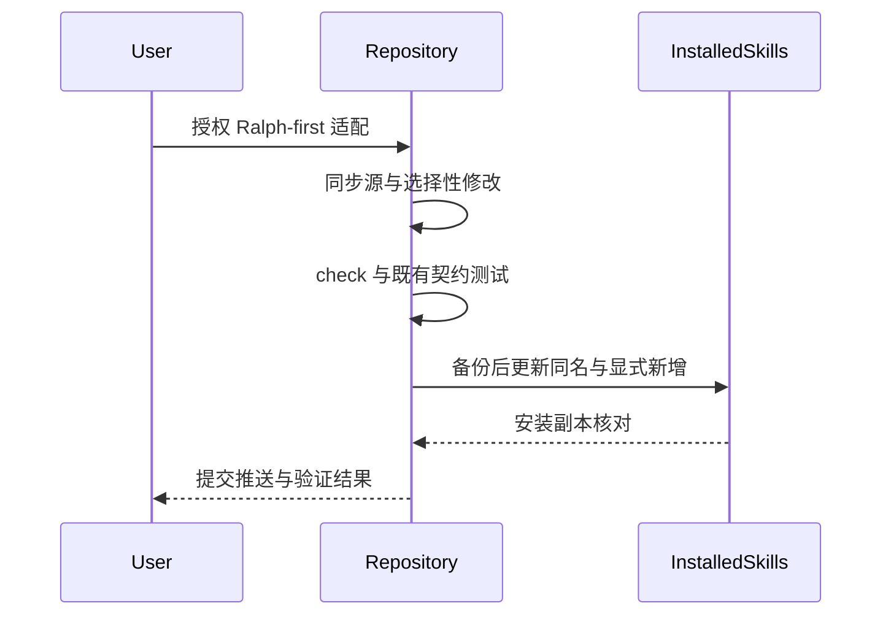
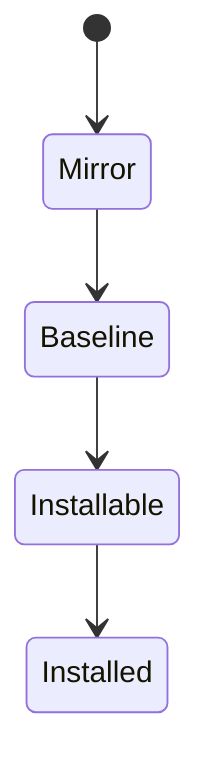
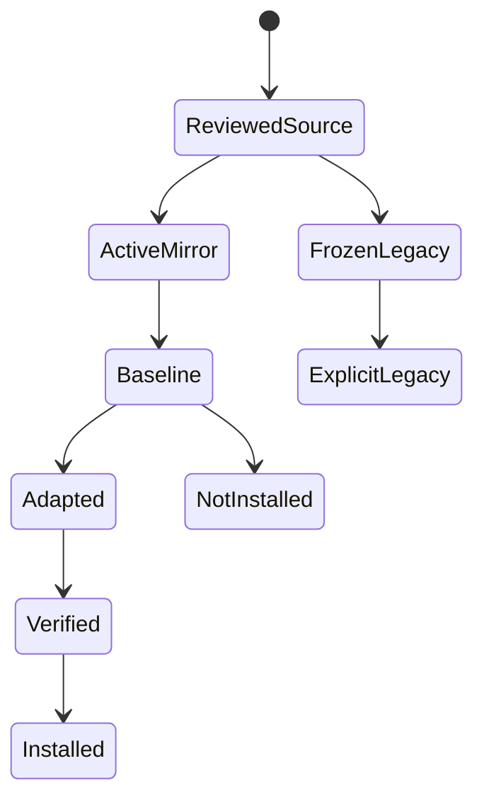
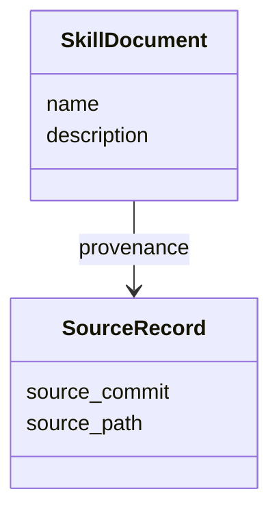
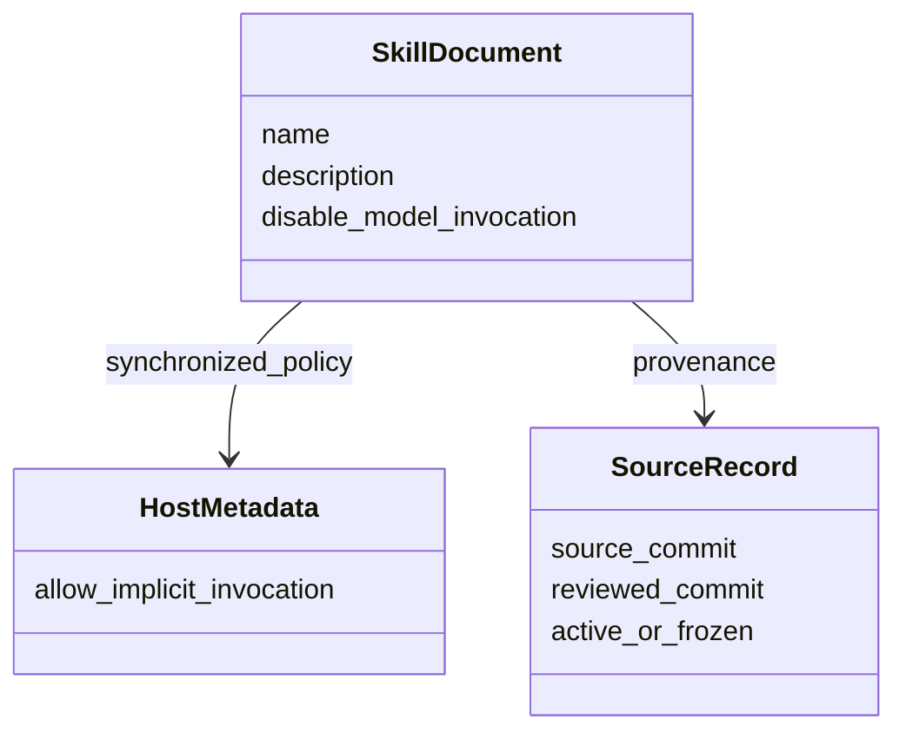

# Ralph-first 上游适配交付

**补充更正：** 首轮提交 `6d16f00` 的中文基线仍有遗漏，不能用数量、来源 SHA 或 metadata 校验通过证明正文已完整同步。下方首轮验证保留为当时快照；文末记录后续补齐和新验证。Ralph-first 定制与安装脚本保护不变。

目标来源：`49dd158d1076134a641b33efb035946536778336`（v1.3.1 + main 修复）。用户已确认：Ralph 为实施标准，展示隐藏凭据不改变原始数据，旧个人 skills 保留，不安装 chief-of-staff。

审计最初固定到 `b0618bc…`；实施期间又复查了 2026-10-09 的两项提交：retro 始终加载写作纪律的范围说明，以及未安装 Wizard 的模板修复。新 HEAD 仅用于 mirror / baseline 的忠实源和 reviewed 记录，不引入额外安装流程。

## 范围与设计 Gate

修改知识文档、调用 metadata、三层来源记录、安装清单及现有维护校验；不修改 Ralph / producer 的 Python 运行代码或 Ticket Git 协议，不启动循环。新增 skill 和 metadata / glossary 契约涉及调用与文档边界，下面先记录局部当前 / 目标图，不新增 ADR 或执行平台。

Module 是 skill 文档、三层同步源与仓库校验；Interface 是 SKILL.md / openai.yaml、领域文档 pointer 和现有 check CLI；Implementation 是翻译、选择性指令和校验。Seam 是安装发现与 host 触发；没有新 Adapter。Depth / Locality 由复用既有 Ralph 契约与本地统一校验获得。测试表面是公开文件契约、check CLI、安装发现，以及原有 Ralph / publisher CLI 测试。

C4：Context 为用户与外部上游 / Pi / Codex；Container 为仓库的 mirror、baseline、installable 资源；Component 为 skill 与 maintenance check；Code 视角是下面的文档字段，不新增生产 class。

### 架构 / 调用：当前

### 架构 / 调用：目标

### 时序：当前

### 时序：目标

### 状态：当前

### 状态：目标

### 文档字段：当前

### 文档字段：目标

## 交付与证据

### 已交付

- 英文 mirror 与中文 baseline 各 46：38 个 active 对齐审阅 SHA，8 个 legacy 保留旧 SHA。英文 active 的 103 个源文件和全部 frozen 源文件均逐字节核对；无多余旧文件。baseline 中 3 个 shell 脚本/模板和 1 份 CJS 配置与英文来源字节一致，未执行 Wizard。
- 原有 50 个安装名全部保留，仅新增 `pr-lqy`、`retro-lqy`、`writing-for-agents-lqy`，总数 53；未安装 chief-of-staff、implement-spec、wizard 或 TS setup。
- 吸收展示副本隐藏凭据、已尝试 mutation 的落地证据、Ticket fetch/title、显式补缺失标签、Teach 路径/quiz、frontier 依赖意识、架构热点和 Wayfinder 标签隔离。Ralph 单 Ticket / Git / blocker / review / green-only refactor 合同保留。
- 本仓库 `CONTEXT.md` 与 domain-format 改为 GLOSSARY；现用消费者、setup 模板及校验同步。旧项目继续使用原有权威文档，不自动迁移或双写。
- Pi / Codex 调用 metadata 同步；仓库本地校验支持它们，不修改用户系统 validator。已授权 Ralph worker 的 implement / tdd / review 仍可加载。
- Ralph 与三个 publisher 的仓库运行 Python 代码相对 fixed point `7879fb8…` 不变。修正原 setup seed 的 remote-default/main 旧措辞，使其匹配既有 current attached branch 执行合同；对应新测试先 RED 后 GREEN。

### 验证结果

| 检查 | 实际结果 |
| --- | --- |
| `uv run --no-project --with pyyaml python scripts/check_matt_zh_skills.py` | 通过；53 installable、38 Matt LQY、46 baseline、46 mirror |
| 新维护 / CLI 契约测试 | 10 通过 |
| Ralph regression | 66 通过 |
| to-spec / to-tickets / triage publishers | 6 / 21 / 9 通过；仓库测试共 **112** |
| `npx skills@latest add . --list` | 仅发现 53 个安装版；三项新增和旧写作名均在，非安装层未泄漏 |
| Pi 1.1.0 原生 loader | 仓库 53 个、全局实际 62 个，零 diagnostics；显式入口不进入自动 prompt，worker 依赖可见 |
| Codex 0.156.1 原生 `skills/list` | 隔离 HOME / CODEX_HOME，无 model turn：仓库 53 个零错误，45 interface；实际更新的 22 个均发现且 interface 加载 |
| 当前/目标 8 张 Mermaid 图 | 使用已安装 grok-mermaid 0.2.3 解析与终端渲染，无 warnings；未安装额外 renderer |
| 安装版定制 workspace tests | 25 通过，包含保留的二次 signal 行为测试 |
| 安装版 publisher CLI tests | 21 通过；默认 fixture 假设仓库布局，直接运行会找错 validator 路径；仅在测试进程内将 fixture 指向实际安装的 validator 后重跑，未改生产代码或测试文件 |
| `git diff --check` / staged check | 通过 |

双轴 Broad Review 均 accepted；随后针对 setup seed 修复 resume 原 reviewers 作 Focused Closure，均 closed。总计 4 次 reviewer 调用，无第三轮。Clean 冻结 413 文件，应用一次判断，未产生额外 cleanup 变更。

### 安装副本与保护

实际定向更新 `~/.agents/skills` 中 19 个已有 Matt / Ralph 同名技能，并增加批准的 3 个新技能。未机械执行整目录覆盖；原有 `clean` 及其它来源保持不动。

备份：`~/.cache/skills-sync-lqy/install-backups/2026-10-09-wlynt6r4/`，含 manifest。安装前后逐文件核对，并保留以下安装独有定制的原始字节：

- `to-tickets-lqy/scripts/publish_ticket_set.py`：已有 publication-gate recovery。
- `ralph-plan-lqy/scripts/run_locked_ralph.py`：已有 signal-handling 定制。
- `ralph-plan-lqy/tests/test_workspace_management.py`：对应已有测试。

除已迁移且备份的旧 `CONTEXT-FORMAT.md` 外，没有删除安装独有文件。没有改动原始凭据、业务数据、应用配置或真实复现输入，没有执行 GitHub 标签写操作，也没有启动真实 Ralph / schedules。

### 限制与生效

测试证明文件合同、原生加载/metadata、隔离 CLI 和现有 workflow 行为；不是一次完整的真实模型驱动 Ralph 验收，不声称 Pi prompt 测试等同 Codex 隐式调用端到端测试。调查报告保留实施前快照。本轮不升级 Pi/Codex/plugins，不安装安全依赖或认证流程。

Pi 使用 `/reload` 或新会话重新发现；Codex 新会话加载。已经进入当前会话的旧正文不会因磁盘复制自动从上下文移除。

## 后续中文基线补齐

迟到的同步报告指出翻译未完成，复核确认首轮“全部完成”的说法过早。按实际源差异补齐，不把英文标点调整当作必须重译的语义变化；`codebase-design`、DEEPENING、ADR 格式及三项 writing beta 的既有正文已包含相关语义。

- 恢复 15 个 active baseline 的 `disable-model-invocation` 与 4 个中文 `argument-hint`。
- 补上 Teach 的 workspace / skill-template 路径区分和正确答案位置变化；修订四份格式说明中的全角 Markdown 标题、状态字面量及误译。
- 更新 GitHub 完整 JSON 读取、sub-issue 命令和外部 PR API；更新 GitLab `-O json` / `<child-iid>`；本地模板使用 `spec.md`、每 Ticket 单文件和原样 `Status:`。
- 移除 to-spec / code-review 的旧 PRD 提示；缺 setup 配置时提示用户显式调用，而不是自动执行 setup。
- 修订 HTML 报告说明中的旧误译，恢复 `tracking-wider` 与源代码示例。LQY 同名文件此前仅有 skill 后缀差异，没有独立定制，因此同步修正并保留 `-lqy` 引用。

新维护测试先捕获调用字段/命令遗漏，再捕获 HTML 示例差异，均已 RED → GREEN。当前维护 **13**、Ralph **66**、三个 publishers **6 / 21 / 9**，合计 **115** 通过；维护 CLI 和安装发现仍为 **53 / 38 / 46 / 46**，非安装层未泄漏。当前英文 **103 active / 9 frozen 源文件**及上述 **4 shell/config 文件**再次逐字节通过，8 个 frozen baseline 未修改。裸 `python` 不可用，既有回归用现成 `python3` 完成，未更改系统环境。

实际安装只更新 `improve-codebase-architecture-lqy/HTML-REPORT.md`，更新前核对无安装独立修改并备份到 `~/.cache/skills-sync-lqy/install-backups/2026-10-09-baseline-completion-zwry4tfn/`。全局 2244 个非缓存文件前后比较，变化仅此一份文档；三份受保护的安装定制与原 `clean` 的字节/哈希再次通过。仓库 Ralph / publisher 运行代码、个人策略和其它安装副本不变。

另做了一次只读基线语义抽核，定位并核实 spec 旧提示与 HTML 类名问题；它不是逐句翻译证明，也不是新一轮 Standards / Spec review。首轮四次双轴 review 记录不作为后续改动已经复审的证据。没有启动 Ralph、schedule 或 GitHub 写操作。
