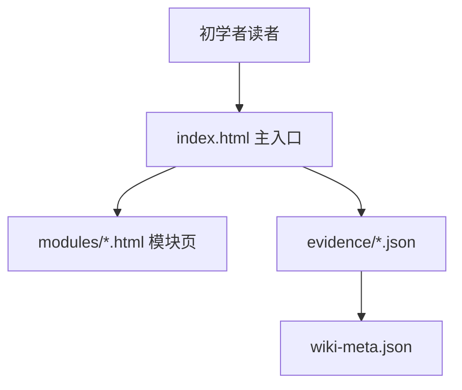
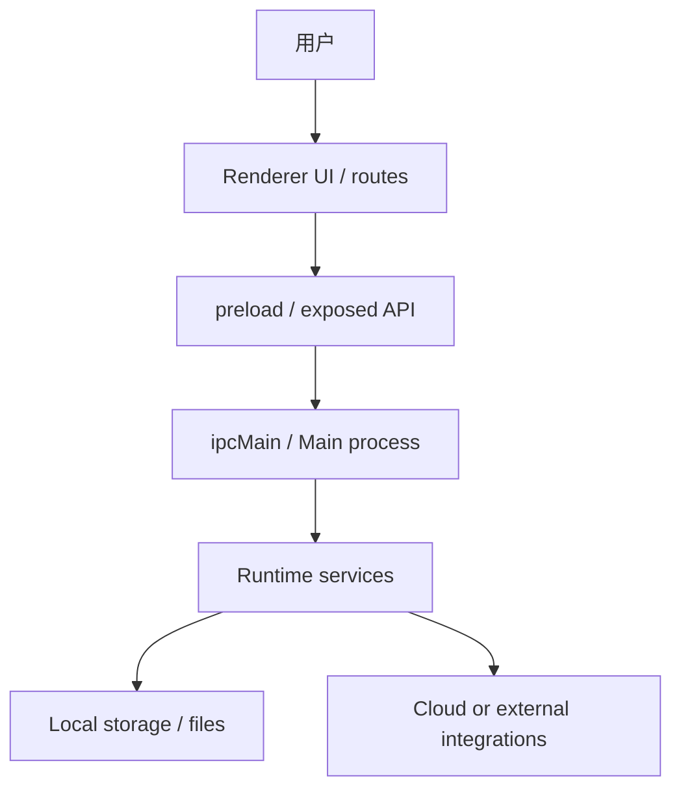

# Architecture-web output reference

This reference defines the `architecture-web` mode for `gitnexus-codex-wiki`. It is a Codex-authored static website flow: GitNexus supplies graph/index evidence, and Codex writes the pages directly. It is not native `gitnexus wiki`, not GitNexus provider configuration, and not a Codex-subscription-as-API-key flow.

## Design contract: project-explainer-web style

Architecture-web pages must follow the same reader experience as `$project-explainer-web`:

- Default language is Chinese (`zh-CN`) unless the user explicitly requests English.
- The root has **exactly one** main HTML page: `index.html`.
- `index.html` is the click-through hub. It links to every `modules/<slug>.html` page listed in `evidence/module-map.json`.
- Module/detail pages live under `modules/` and link back to `../index.html`. They must not become separate root landing pages.
- Styling should use the project-explainer-web visual grammar: soft gradient background, `.shell`, `.hero`, `.panel`, cards, tags, tree blocks, readable tables, and short scannable sections.
- Mermaid is offline-safe: use local `assets/mermaid.min.js` or hand-authored inline SVG for rendered diagrams. CDN Mermaid is invalid.
- Final pages must not show raw `graph TB` / `flowchart` text as the visible diagram. Keep graph source only in collapsed `<details class="source-note">` after the rendered diagram when auditability is needed.

## Semantic contract: explain the target system, not the artifact

The architecture-web artifact is a container. Its subject is the target application/system. In final output:

- `index.html` is a navigation hub, not an architecture component.
- `modules/*.html`, `evidence/*.json`, `_learn_web`, `wiki-meta.json`, Mermaid rendering, and the Codex/GitNexus generation workflow are supporting artifact details only.
- Main headings, diagrams, module cards, and flow explanations must center target-system entities found in source: UI/renderer entrypoints, route handlers, preload/API or IPC bridges, main/runtime processes, services, storage, cloud/local integrations, tests, and domain modules.
- Artifact details may be listed in evidence/metadata sections or footer notes, but must never be the central diagram or primary module taxonomy.

Invalid artifact-centric overview diagram:



Valid target-system-centric overview diagram:



## Directory tree

Default output when `--out` is omitted:

```text
_learn_web/<slug>-architecture-wiki/
├─ index.html                     # the only root/main HTML page
├─ modules/
│  └─ <module>.html               # linked from index.html
├─ assets/
│  └─ mermaid.min.js              # local/offline Mermaid when available
├─ evidence/
│  ├─ module-map.json
│  └─ route-service-trace.json
└─ wiki-meta.json
```

## Scaffold CLI examples

```bash
python3 ~/.codex/skills/gitnexus-codex-wiki/scripts/scaffold-architecture-web.py \
  --repo . \
  --slug lucyna \
  --module frontend-routes \
  --module ipc-services \
  --evidence docs/gitnexus-codex-wiki/evidence/preflight.md
```

The scaffold defaults to Chinese and auto-copies project-explainer-web's bundled Mermaid runtime when available. Use `--no-default-mermaid-js` only during scaffolding or when you will replace static source with inline SVG before final delivery.

## Required page contracts

Overview headings in `index.html`:

- `总览摘要`
- `为什么要先理解它`
- `真实源码目录树`
- `整体运行时结构图`
- `用户动作到运行时流程`
- `源码证据地图`
- `优先阅读文件`
- `技术框架图`
- `边界与不变量`
- `安全修改方式`
- `验证命令`
- `常见反模式`
- `原理与背景知识`
- `约束与风险`
- `推荐维护方案`
- `后续维护动作`

Every `modules/<module>.html` page must include:

- `模块职责`
- `为什么存在`
- `真实源码目录树`
- `整体运行时结构图`
- `数据如何流动`
- `用户动作到运行时流程`
- `源码阅读入口`
- `源码证据地图`
- `优先阅读文件`
- `技术框架图`
- `边界与不变量`
- `安全修改方式`
- `源码证据`
- `验证命令`
- `常见反模式`
- `原理与背景知识`
- `约束与风险`
- `推荐维护方案`
- `后续维护动作`

The writing style should be Feynman-style: explain a small piece plainly, name the source or graph evidence behind it, then show how a beginner can verify it. Treat this as a prose principle only; do not generate a repeated fixed section named `费曼复述`.

Deep architecture pages must show real source relationships and branches:

- `index.html` visibly includes a real source directory tree, a technology/framework tree, a runtime boundary graph, a route/service/IPC or equivalent flow graph, and a branch overview graph.
- Module pages include files plus key symbols/handlers/API/IPC/service entrypoints, a relationship graph, and a branch/failure/fallback table or graph with at least three source-grounded paths.
- Electron pages show renderer/preload/main trust boundaries and multiple IPC/service branches.
- Chat/runtime pages show provider/runtime branches, local/cloud or model-sync branches, and stream event branches when present.
- Auth/session pages show login, refresh, logout, invalid-auth, and credential/provider branches when present.
- Hidden generic contract text must never be used to satisfy validation; required concepts must be visible or stored in structured evidence JSON.

## Required JSON schemas

`wiki-meta.json` requires the base fields and should include the UI contract fields:

```json
{
  "generated_at": "2026-04-28T00:00:00Z",
  "repo": "/path/to/repo",
  "git_commit": "<commit-or-unavailable>",
  "gitnexus_version": "gitnexus 1.6.3",
  "execution_boundary": "GitNexus supplies graph/index evidence; Codex authors architecture-web pages directly. Native gitnexus wiki provider/API-key setup is separate.",
  "mode": "architecture-web",
  "language": "zh-CN",
  "visual_style": "project-explainer-web",
  "entrypoint": "index.html",
  "modules": ["core"],
  "evidence_files": [{"source": "/path/preflight.md", "path": "evidence/preflight.md"}]
}
```

`evidence/module-map.json` requires `modules[]` objects with `slug`, `title`, `source_files`, `graph_commands`, `evidence_refs`, and `verification_commands`.

`evidence/route-service-trace.json` requires `flows[]` objects with `slug`, `title`, `entrypoints`, `services`, `graph_edges`, and `evidence_refs`.

## Mermaid policy

Use Mermaid `graph TB` source for diagram audit trails, but final HTML pages need a rendered visual form: local Mermaid-rendered `<div class="mermaid">...</div>` or hand-authored inline SVG. If source is included, put it inside collapsed `<details>` after the rendered diagram, not as a visible raw `<pre>` block.

At least one relevant graph on the homepage and each deep module page should branch (one node has multiple outgoing or incoming edges). A single straight line such as `User -> Renderer -> Preload -> Main -> Runtime` is not enough for final architecture-web output.

Mermaid-safe syntax rules:

- Quote labels with punctuation or separators: `Preload["preload / electronAPI"]`, not `Preload[preload / electronAPI]`.
- Avoid lowercase `end` as a node id or unquoted label; use `End` or `EndNode["end"]`.
- Add whitespace after arrows when a destination node id starts with lowercase `o` or `x`; otherwise Mermaid can interpret the link as a circle/cross edge.
- Final pages must not contain visible `parse error`, `syntax error in text`, or diagram-validation failure text.
- Final pages must not leave `graph TB` / `flowchart` source visibly exposed as body text; browser visual QA should fail if raw graph source is visible.
- Use the skill validator as a static preflight, then run browser visual QA for rendered diagrams.

Invalid Mermaid reference:

```html
<script src="https://cdn.jsdelivr.net/npm/mermaid/dist/mermaid.min.js"></script>
```

Valid local rendered Mermaid reference:

```html
<script defer src="./assets/mermaid.min.js"></script>
```

Valid source audit trail after a rendered diagram:

```html
<div class="diagram"><svg role="img" aria-label="runtime flow">...</svg></div>
<details class="source-note">
  <summary>图源</summary>
  <pre class="diagram-source">graph TB
    Route["UI route"] --> Service["runtime service"]
  </pre>
</details>
```

## Strict vs scaffold validation

Scaffolds are allowed to contain `TODO` placeholders until Codex replaces them with evidence-grounded content. Final outputs are not.

```bash
python3 ~/.codex/skills/gitnexus-codex-wiki/scripts/validate-skill.py \
  ~/.codex/skills/gitnexus-codex-wiki \
  --architecture-web-dir _learn_web/lucyna-architecture-wiki
```
