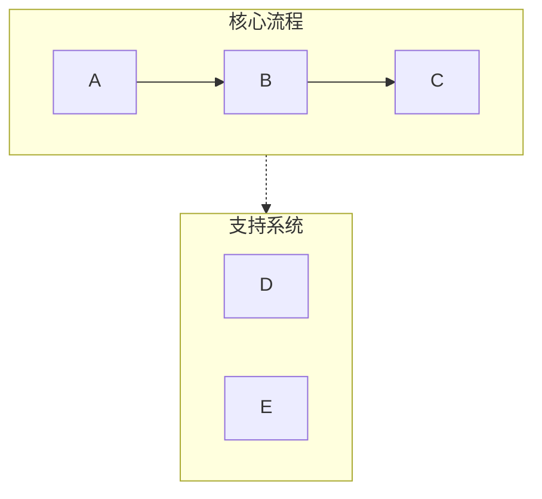
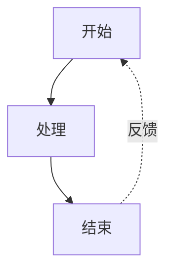
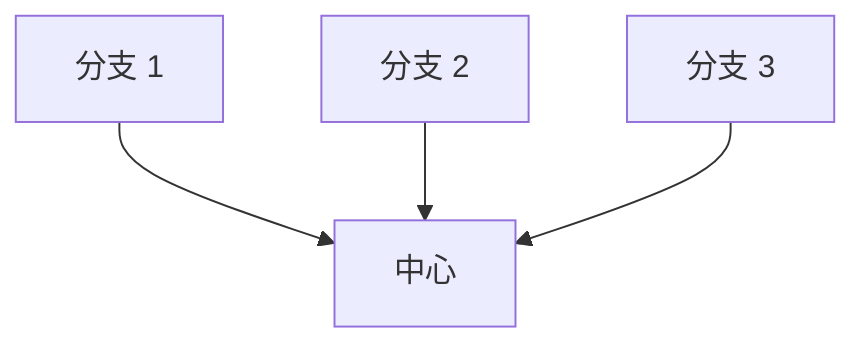

# Mermaid 可视化

## 概述

将文本内容转换为清晰、专业且适合演示和文档的 Mermaid 图。主动规避列表语法冲突、子图命名和空格等常见问题，确保图表能够在 Obsidian、GitHub 及其他兼容 Mermaid 的平台正确渲染。

## 快速开始

创建 Mermaid 图时：

1. **分析内容**：识别关键概念、关系和流程。
2. **选择图表类型**：选择最适合的可视化方式，参见“图表类型”。
3. **选择配置**：确定布局、细节层级和样式。
4. **生成图表**：创建语法正确的 Mermaid 代码。
5. **输出 Markdown**：使用正确的代码围栏，可按需附上简短说明。

**默认设置：**

- 除非用户要求横向布局，否则使用纵向布局（TB）。
- 使用标准细节层级，在简洁和信息量之间取得平衡。
- 使用带语义色彩的专业配色。
- 使用兼容 Obsidian 和 GitHub 的语法。

## 图表类型

### 1. 流程图（graph TB/LR）

**适合：** 工作流、决策树、顺序流程、AI agent 架构。

**使用条件：** 内容描述步骤、阶段或一系列动作。

**主要特点：**

- 使用 subgraph 泳道对相关步骤分组。
- 使用箭头标签说明转换关系。
- 支持反馈回路和分支。
- 按阶段使用不同颜色。

**配置选项：**

- `layout`：`vertical`（TB）、`horizontal`（LR）。
- `detail`：`simple`（仅核心步骤）、`standard`（包含说明）、`detailed`（包含注释）。
- `style`：`minimal`、`professional`、`colorful`。

### 2. 循环流程图（带循环布局的 graph TD）

**适合：** 循环流程、持续改进闭环、agent 反馈系统。

**使用条件：** 内容强调迭代、反馈或循环关系。

**主要特点：**

- 中心节点与放射状元素。
- 弯曲的反馈箭头。
- 清晰的循环标识。

### 3. 对比图（带并行路径的 graph TB）

**适合：** 前后对比、A 与 B 分析、传统系统与现代系统对比。

**使用条件：** 内容比较两个或多个方案或系统。

**主要特点：**

- 并排布局。
- 中央对比节点。
- 使用颜色或样式清楚区分各方。

### 4. 思维导图（mindmap）

**适合：** 分层概念、知识组织、主题拆解。

**使用条件：** 内容具有清晰的父子层级。

**主要特点：**

- 放射状树形结构。
- 支持多层嵌套。
- 清晰的视觉层级。

### 5. 时序图（sequence diagram）

**适合：** 组件交互、API 调用、消息流。

**使用条件：** 内容涉及参与者或系统随时间发生的通信。

**主要特点：**

- 基于时间顺序的布局。
- 清晰分隔参与者。
- 使用激活框表示处理过程。

### 6. 状态图（state diagram）

**适合：** 系统状态、状态转换、生命周期阶段。

**使用条件：** 内容描述状态及其转换。

**主要特点：**

- 清晰的状态节点。
- 带标签的转换。
- 明确的开始和结束状态。

## 关键语法规则

**始终遵守以下规则，避免解析错误：**

### 规则 1：避免列表语法冲突

```text
❌ 错误：[1. Perception]       → 会触发 "Unsupported markdown: list"
✅ 正确：[1.Perception]        → 删除句点后的空格
✅ 正确：[① Perception]        → 使用带圈数字（①②③④⑤⑥⑦⑧⑨⑩）
✅ 正确：[(1) Perception]      → 使用括号
✅ 正确：[Step 1: Perception]  → 添加 "Step" 前缀
```

### 规则 2：子图命名

```text
❌ 错误：subgraph AI Agent Core          → 含空格的名称没有引号
✅ 正确：subgraph agent["AI Agent Core"] → 使用 ID 和显示名称
✅ 正确：subgraph agent                  → 只使用简单 ID
```

### 规则 3：节点引用

```text
❌ 错误：Title --> AI Agent Core  → 直接引用显示名称
✅ 正确：Title --> agent          → 引用子图 ID
```

### 规则 4：节点文本中的特殊字符

```text
✅ 含空格的文本使用引号：["Text with spaces"]
✅ 转义或避免英文引号，可改用『』
✅ 转义或避免英文括号，可改用「」
✅ 仅在圆形节点中使用换行：((Text<br/>Break))
```

### 规则 5：箭头类型

- `-->`：实线箭头。
- `-.->`：虚线箭头，用于支持系统或可选路径。
- `==>`：粗箭头，用于强调。
- `~~~`：不可见连接，仅用于控制布局。

完整语法和边界情况参见 [references/syntax-rules.md](references/syntax-rules.md)。

## 配置选项

所有图表均接受以下参数：

**布局：**

- `direction`：`vertical`（TB）、`horizontal`（LR）、`right-to-left`（RL）、`bottom-to-top`（BT）。
- `aspect`：`portrait`（默认）、`landscape`（宽屏）、`square`。

**细节层级：**

- `simple`：仅核心元素和最少标签。
- `standard`：包含关键说明的均衡细节，默认值。
- `detailed`：完整注释、解释和元数据。
- `presentation`：针对幻灯片优化，文字更大、细节更少。

**样式：**

- `minimal`：单色、简洁线条。
- `professional`：语义色彩和清晰层级，默认值。
- `colorful`：鲜明色彩和高对比度。
- `academic`：适合论文和正式文档。

**其他选项：**

- `show_legend`：`true`/`false`，是否显示颜色或符号图例。
- `numbered`：`true`/`false`，是否为步骤添加序号。
- `title`：字符串，图表标题。

## 使用示例

**示例 1：基本请求**

```text
用户："可视化软件开发生命周期"
处理：分析 → 选择 graph TB → 使用标准细节生成
```

**示例 2：指定配置**

```text
用户："创建一个详细展示销售流程的横向流程图"
处理：分析 → 选择 graph LR → 使用详细层级生成
```

**示例 3：对比**

```text
用户："比较传统 AI 和 AI agents"
处理：分析 → 选择对比布局 → 使用对比样式生成
```

## 工作流

1. **理解内容**
   - 识别主要概念、实体和关系。
   - 判断内容是层级结构还是顺序结构。
   - 标记其中的比较和对照关系。

2. **选择图表类型**
   - 将内容结构匹配到图表类型。
   - 考虑用户的展示场景。
   - 无法判断时默认使用流程图。

3. **选择配置**
   - 应用用户指定的选项。
   - 对未指定的选项使用合理默认值。
   - 优先保证可读性。

4. **生成 Mermaid 代码**
   - 严格遵守所有语法规则。
   - 使用具有语义的描述性 ID。
   - 使用一致的样式。
   - 检查常见错误：
     - 节点文本中不得出现“数字 + 句点 + 空格”模式。
     - 所有子图使用 `ID["显示名称"]` 格式。
     - 所有节点引用使用 ID，不使用显示名称。

5. **结合上下文输出**
   - 使用 `mermaid` 代码围栏。
   - 简要说明图表结构。
   - 说明与 Obsidian、GitHub 等平台的兼容性。
   - 可提出调整或创建变体，但不要加入无关说明。

## 默认配色

标准专业配色：

- 绿色（#d3f9d8/#2f9e44）：输入、感知、开始状态。
- 红色（#ffe3e3/#c92a2a）：规划、决策点。
- 紫色（#e5dbff/#5f3dc4）：处理、推理。
- 橙色（#ffe8cc/#d9480f）：动作、工具使用。
- 青色（#c5f6fa/#0c8599）：输出、执行、结果。
- 黄色（#fff4e6/#e67700）：存储、记忆、数据。
- 粉色（#f3d9fa/#862e9c）：学习、优化。
- 蓝色（#e7f5ff/#1971c2）：元数据、定义、标题。
- 灰色（#f8f9fa/#868e96）：中性元素、传统系统。

## 常用模式

### 泳道模式（分组）



### 反馈回路模式



### 中心辐射模式



## 质量检查清单

输出前确认：

- [ ] 节点文本中没有“数字 + 句点 + 空格”模式。
- [ ] 所有子图均使用正确的 ID 语法。
- [ ] 所有箭头均使用正确语法（`-->`、`-.->`）。
- [ ] 颜色应用一致。
- [ ] 已指定布局方向。
- [ ] 已提供所需的样式声明。
- [ ] 没有含糊的节点引用。
- [ ] 与 Obsidian 和 GitHub 渲染器兼容。
- [ ] 节点文本中不使用 Emoji，改用文字标签或颜色编码。

## 参考资料

详细语法规则和排错方法参见：

- [references/syntax-rules.md](references/syntax-rules.md)：完整语法参考和错误预防。
