# Mermaid 语法规则参考

本文档汇总 Mermaid 图的语法规则和错误预防方法。遇到语法错误或需要详细语法信息时读取此文件。

## 目录

1. [关键错误预防](#关键错误预防)
2. [节点语法](#节点语法)
3. [子图语法](#子图语法)
4. [箭头和连接类型](#箭头和连接类型)
5. [样式和颜色](#样式和颜色)
6. [布局和方向](#布局和方向)
7. [高级模式](#高级模式)
8. [故障排查](#故障排查)

## 关键错误预防

### 列表语法冲突（最常见错误）

**问题：** Mermaid 解析器会把“数字 + 句点 + 空格”识别为 Markdown 有序列表。

**错误信息：** `Parse error: Unsupported markdown: list`

**解决方法：**

```text
❌ [1. Perception]
❌ [2. Planning]
❌ [3. Reasoning]

✅ [1.Perception]           # 删除空格
✅ [① Perception]           # 使用带圈数字
✅ [(1) Perception]         # 使用括号
✅ [Step 1: Perception]     # 使用前缀
✅ [Step 1 - Perception]    # 使用连字符
✅ [Perception]             # 删除编号
```

**带圈数字参考：**

```text
① ② ③ ④ ⑤ ⑥ ⑦ ⑧ ⑨ ⑩ ⑪ ⑫ ⑬ ⑭ ⑮ ⑯ ⑰ ⑱ ⑲ ⑳
```

### 子图命名规则

**规则：** 名称包含空格时，使用 ID + 显示名称格式。

```text
❌ subgraph Core Process
     A --> B
   end

✅ subgraph core["Core Process"]
     A --> B
   end

✅ subgraph core_process
     A --> B
   end
```

**引用子图：**

```text
❌ Title --> Core Process      # 不能引用显示名称
✅ Title --> core              # 必须引用 ID
```

### 节点引用规则

**规则：** 始终通过 ID 引用节点，不要引用显示文本。

```text
# 定义节点
A[Display Text A]
B["Display Text B"]

# 引用节点
A --> B                            ✅ 使用节点 ID
Display Text A --> Display Text B  ❌ 不能使用显示文本
```

## 节点语法

### 基本节点类型

```mermaid
%% 矩形（默认）
A[矩形文本]

%% 圆角矩形
B(圆角文本)

%% 体育场形状
C([体育场文本])

%% 圆形
D((圆形<br/>文本))

%% 非对称形状
E>右箭头]

%% 菱形（决策）
F{是否继续？}

%% 六边形
G{{六边形}}

%% 平行四边形
H[/平行四边形/]

%% 数据库
I[(数据库)]

%% 梯形
J[/梯形\]
```

### 节点文本规则

**换行：**

- `<br/>` 仅在圆形节点中有效，例如 `((Text<br/>Break))`。
- 其他节点应使用单独的注释节点，或保持文本简短。

**特殊字符：**

- 空格：需要时使用引号，例如 `["Text with spaces"]`。
- 引号：改用『』或避免使用。
- 括号：改用「」或避免使用。
- 冒号：通常安全，出现问题时避免使用。
- 连字符和破折号：可以安全使用。

**长度建议：**

- 节点文本保持在 50 个字符以内。
- 较长内容可在圆形节点内换行，或拆成独立注释节点。
- 文本过长时考虑拆分为多个节点。

## 子图语法

### 基本结构

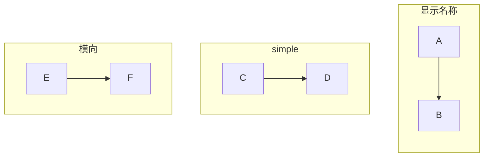

### 嵌套子图

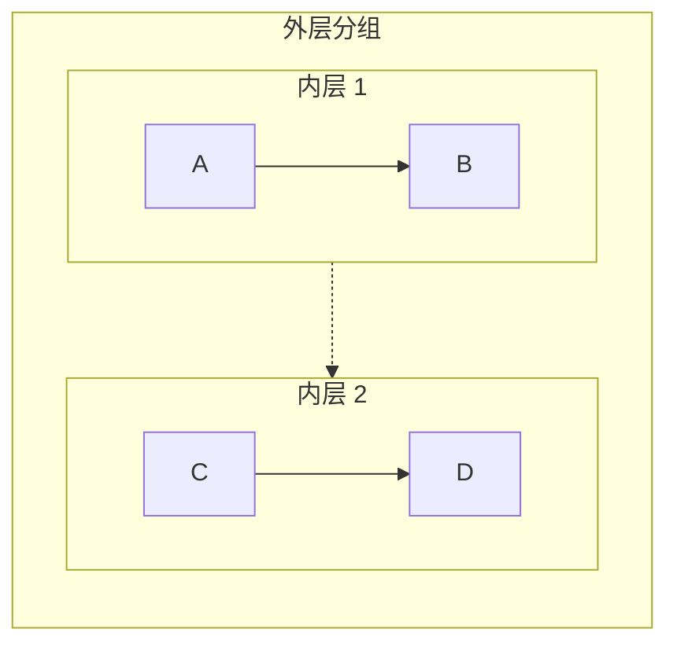

**限制：** 为保证可读性，嵌套层级最多保持在两层。

### 连接子图

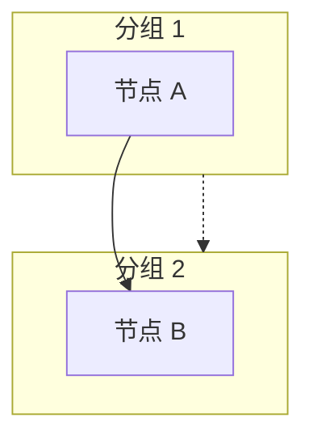

## 箭头和连接类型

### 基本箭头

```text
A --> B          # 实线箭头
A -.-> B         # 虚线箭头
A ==> B          # 粗箭头
A ~~~ B          # 不可见连接，仅用于布局
```

### 箭头标签

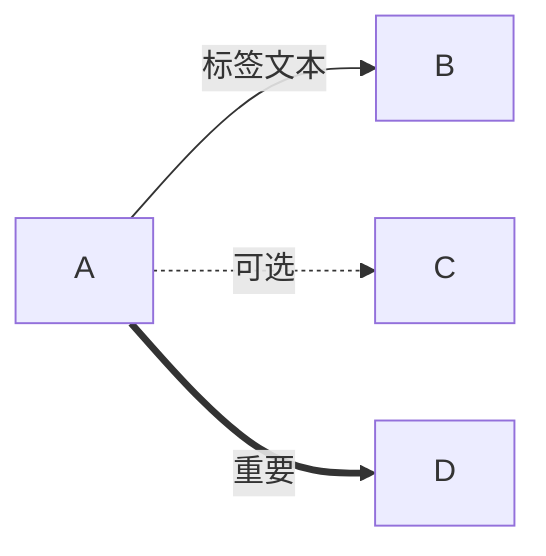

### 多目标连接

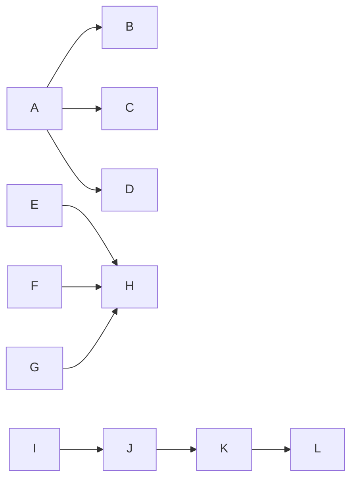

### 双向连接

```text
A <--> B         # 双向实线
A <-.-> B        # 双向虚线
```

## 样式和颜色

### 行内样式

```text
style NodeID fill:#color,stroke:#color,stroke-width:2px
```

### 颜色格式

- 十六进制颜色：`#ff0000` 或 `#f00`。
- RGB：`rgb(255,0,0)`。
- 颜色名称：`red`、`blue` 等，支持范围有限。

### 常用样式模式

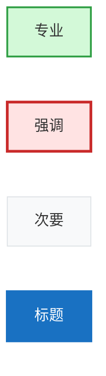

### 设置多个节点的样式

```text
style A,B,C fill:#d3f9d8,stroke:#2f9e44,stroke-width:2px
```

## 布局和方向

### 方向代码

```text
graph TB    # 从上到下（纵向）
graph BT    # 从下到上
graph LR    # 从左到右（横向）
graph RL    # 从右到左
graph TD    # 从上到下，与 TB 相同
```

### 布局控制建议

1. **纵向布局（TB/BT）：** 适合顺序流程和层级结构。
2. **横向布局（LR/RL）：** 适合时间线和宽屏展示。
3. **混合方向：** 在不同子图中分别设置方向。

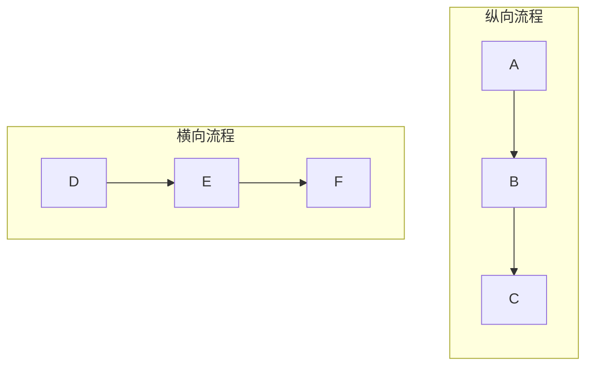

## 高级模式

### 反馈回路模式

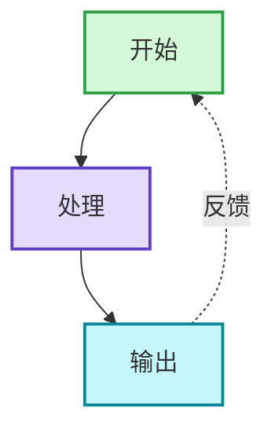

### 泳道模式

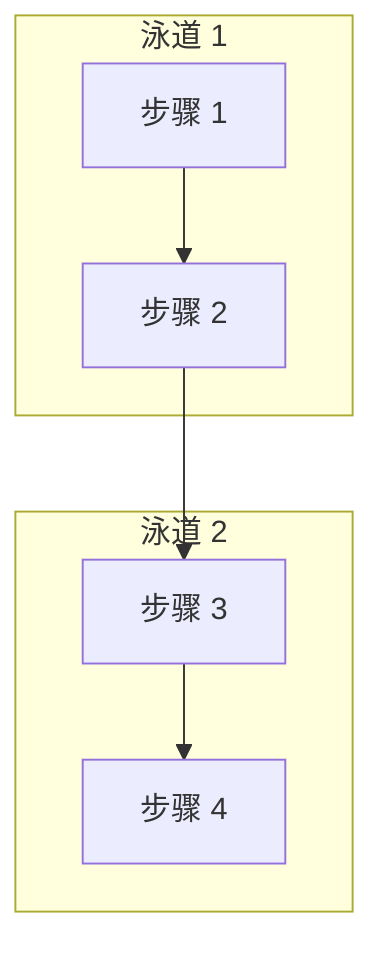

### 中心辐射模式

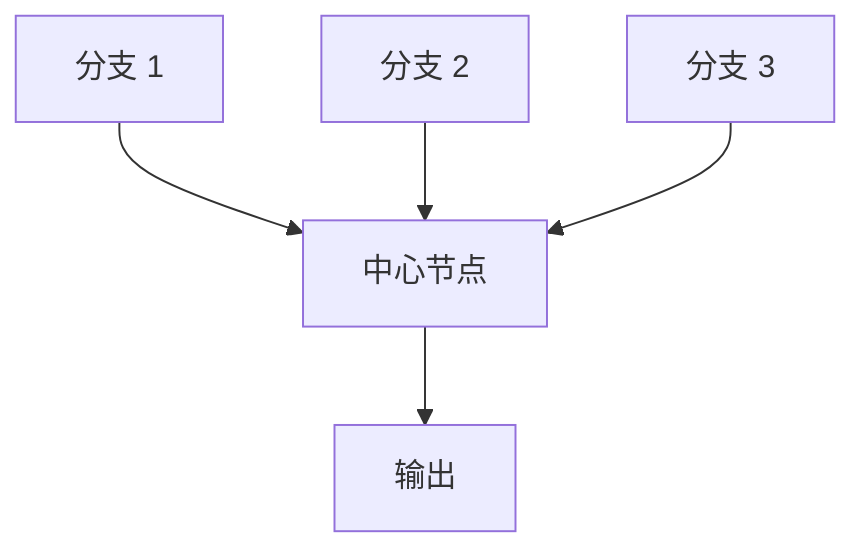

### 决策树

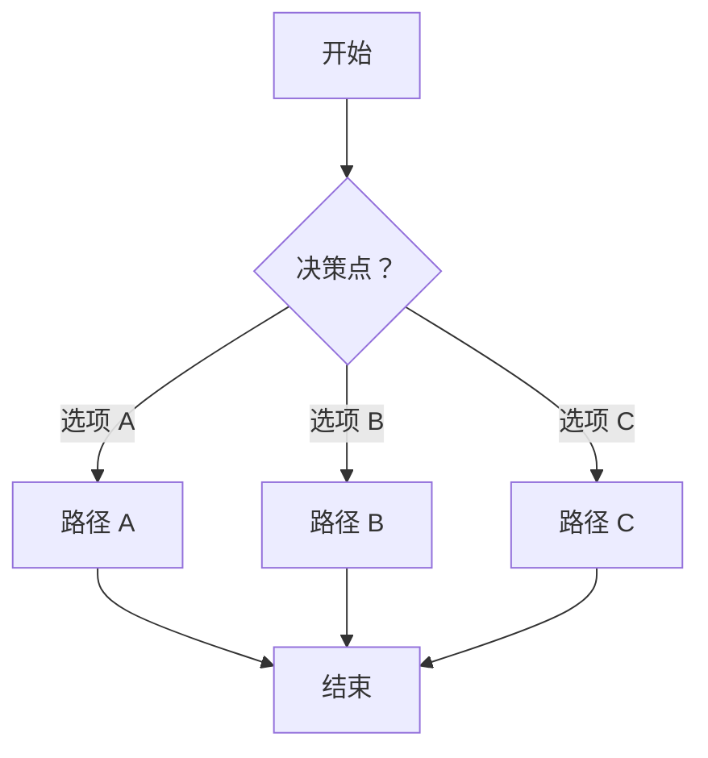

### 对比布局

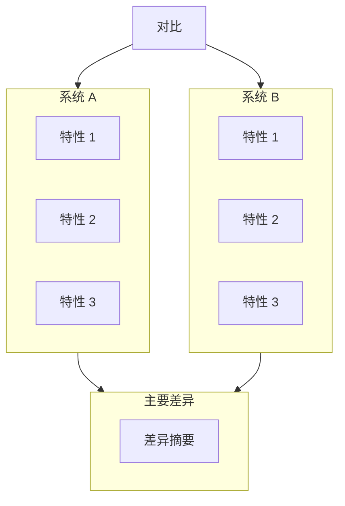

## 故障排查

### 常见错误及解决方法

#### 错误：`Parse error on line X: Expecting 'SEMI', 'NEWLINE', 'EOF'`

**原因：**

1. 子图名称包含空格，但没有使用 ID 格式。
2. 节点引用使用了显示文本而不是 ID。
3. 节点文本包含无效特殊字符。

**解决方法：**

- 使用 `subgraph id["Display Name"]` 格式。
- 只通过 ID 引用节点。
- 为包含特殊字符的节点文本添加引号。

#### 错误：`Unsupported markdown: list`

**原因：** 节点文本使用了“数字 + 句点 + 空格”模式。

**解决方法：** 删除空格，或使用 `①`、`(1)`、`Step 1:` 等替代格式。

#### 错误：`Parse error: unexpected character`

**原因：**

1. 特殊字符没有转义。
2. 引号使用不当。
3. Mermaid 语法无效。

**解决方法：**

- 替换问题字符，例如引号改为『』、括号改为「」。
- 使用正确的节点定义语法。
- 检查箭头语法。

#### 图表没有正确渲染

**原因：**

1. 缺少样式声明。
2. 方向设置错误。
3. 连接无效。

**解决方法：**

- 确认所有样式声明均使用有效语法。
- 确认在 graph 声明或 subgraph 内设置了方向。
- 确认所有节点 ID 均先定义再引用。

### 验证检查清单

完成图表前确认：

- [ ] 节点文本中没有“数字 + 句点 + 空格”模式。
- [ ] 名称含空格的子图均使用正确的 ID 语法。
- [ ] 所有节点引用使用 ID，不使用显示文本。
- [ ] 所有箭头均使用有效语法（`-->`、`-.->`）。
- [ ] 所有样式声明均符合语法。
- [ ] 已明确设置方向。
- [ ] 节点文本中没有未转义的特殊字符。
- [ ] 所有连接均引用已定义的节点。

### 平台注意事项

**Obsidian：**

- 可能使用较旧的 Mermaid 版本，解析更严格。
- 对 `<br/>` 的支持有限，优先只在圆形节点中使用。
- 完成前测试图表。

**GitHub：**

- Mermaid 支持较好。
- 能够渲染大多数现代语法。
- 渲染结果可能与 Obsidian 略有差异。

**Mermaid Live Editor：**

- 使用较新的解析器。
- 适合测试新语法。
- 可能支持 Obsidian 或 GitHub 尚未支持的功能。

## 快速参考

### 安全编号方式

```text
✅ 1.Text  ①Text  (1)Text  Step 1:Text
❌ 1. Text
```

### 安全子图语法

```text
✅ subgraph id["Name"]  subgraph simple_name
❌ subgraph Name With Spaces
```

### 安全节点引用

```text
✅ NodeID --> AnotherID
❌ "Display Text" --> "Other Text"
```

### 安全特殊字符

```text
✅ 使用『』代替引号，使用「」代替括号
❌ 未转义的英文引号，以及容易引发歧义的英文括号
```
