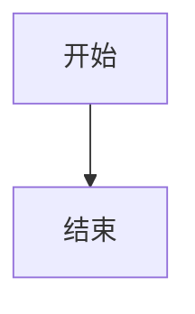
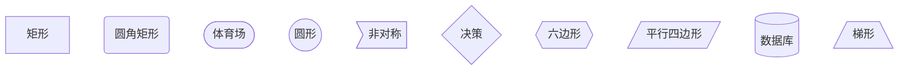
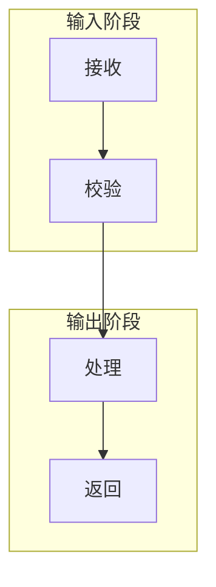
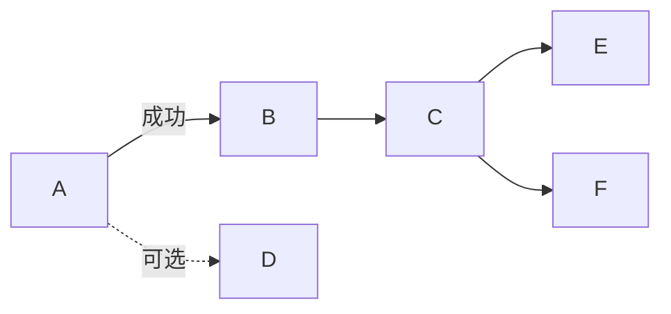
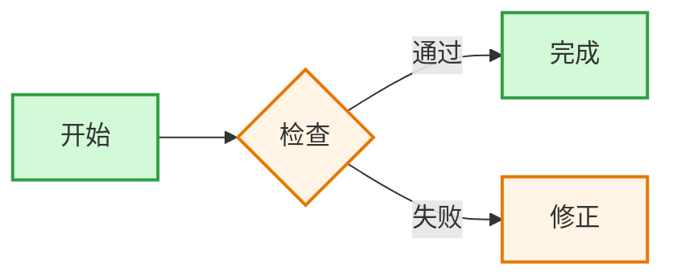
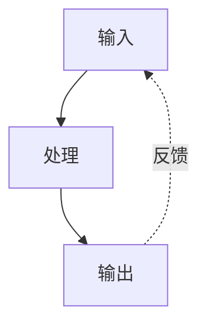
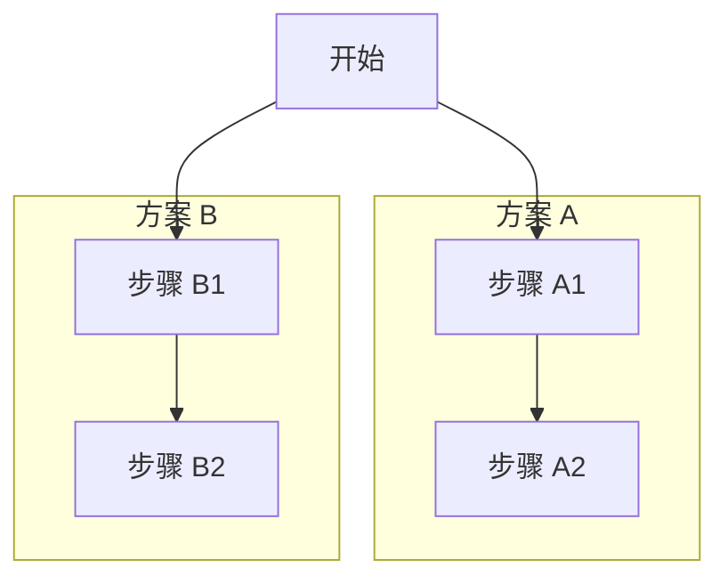
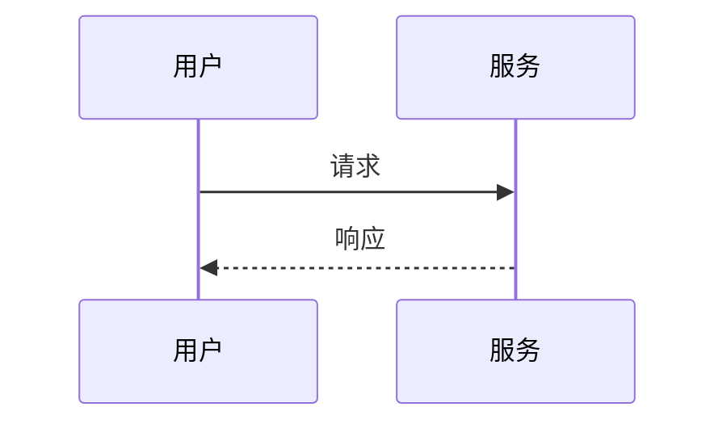
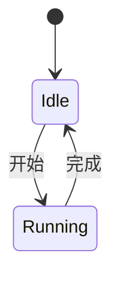
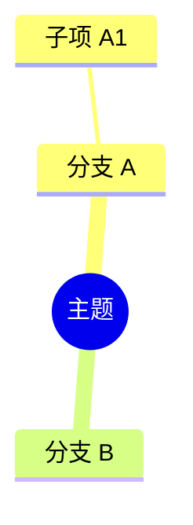

# Mermaid 语法参考

需要选择具体语法或排查渲染问题时，按相关章节读取。

## 图表声明

每个 Mermaid 代码块必须先声明图表类型。流程图使用：



常用方向：

| 方向 | 含义 |
| --- | --- |
| `TB` 或 `TD` | 从上到下 |
| `BT` | 从下到上 |
| `LR` | 从左到右 |
| `RL` | 从右到左 |

## 节点



- 使用稳定且简短的 ID，通过 ID 建立连接：`A --> B`。
- 标签含空格或特殊字符时使用引号：`A["显示文本"]`。
- 避免 `1. 步骤` 形式，它可能被识别为 Markdown 列表；改用 `步骤 1`、`(1) 步骤` 或 `1.步骤`。
- 标签保持简短；内容太多时拆分节点，不依赖复杂换行。

## 子图

名称含空格时，为子图提供独立 ID 和显示名称。优先连接子图内的具体节点。



避免超过两层嵌套；层级更深时拆图通常更清楚。

## 连接

```text
A --> B          实线箭头
A -.-> B         虚线箭头
A ==> B          粗箭头
A <--> B         双向实线
A ~~~ B          不可见连接，仅用于布局
```

标签、链式连接和多目标连接：



## 样式

只在样式能表达含义时使用，并保持同一语义使用同一颜色。重复样式使用 `classDef`：



单个节点可使用：

```text
style A fill:#d3f9d8,stroke:#2f9e44,stroke-width:2px
```

## 常用模式

反馈回路：



并行分组：



## 其他图表骨架

时序图：



状态图：



思维导图：



## 排错

| 现象 | 常见原因 | 处理 |
| --- | --- | --- |
| `No diagram type detected` | 缺少图表声明 | 在首行添加 `flowchart TB` 等声明 |
| `Unsupported markdown: list` | 标签包含 `数字 + 句点 + 空格` | 改用 `步骤 1`、`(1)` 或删除空格 |
| 子图解析失败 | 直接把含空格名称当作 ID | 使用 `subgraph id["显示名称"]` |
| 节点或连接解析失败 | 引用了显示文本，或标签含歧义字符 | 连接节点 ID，并为标签加引号 |
| 不同平台渲染结果不同 | Mermaid 版本不同 | 使用目标平台支持的基础语法并在该平台验证 |

输出前确认代码块有图表声明、所有连接引用已定义的 ID，并实际解析 Mermaid 代码。
